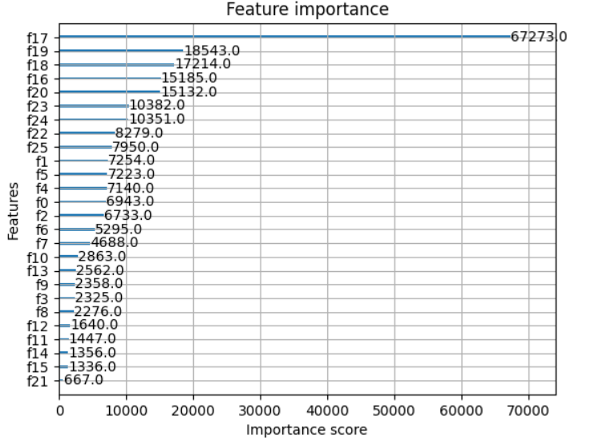

# Road Accident Risk Project

This project builds a high-performance machine learning model to predict the probabilistic risk of a road accident on a given segment. The model was optimized using `XGBoost` and `Optuna` to achieve top-tier results.

**This project was developed as part of a Kaggle competition, and I imagined the theoretical goal would be to build a tool that could be used by city planners etc to identify and mitigate high-risk areas.**

> **View the main analysis notebook:** `[predicting-road-accident-risk-with-xgboost.ipynb]`



---

### Tech stack

* **Data analysis:** `pandas`, `numpy`
* **Data visualization:** `seaborn`, `matplotlib`
* **Preprocessing:** `scikit-learn`
* **Modeling:** `XGBoost`
* **Optimization:** `Optuna`
* **Validation:** `scikit-learn KFold`

---

### The goal 

The goal was to predict `accident_risk` (a continuous value from 0 to 1) based on features like road type, weather, lighting, and speed limits.

#### 1. Feature Engineering
To capture more complex relationships, I engineered new features:
* `accidents_per_lane`: A ratio to normalize accident counts by road size.
* `weather_and_time`: An interaction feature (e.g., 'Rain_Night').
* `square_speed`: A polynomial feature to capture the non-linear risk of higher speeds.

#### 2. Modeling and Tuning
I chose the `XGBoost Regressor` for its high performance. To find the best possible version of this model, I:
* **Implemented 10 fold Cross validation:** This provides a much more stable and reliable measure of model performance by training and testing 10 different models on different slices of the data.
* **Used `Optuna` for Bayesian optimization:** Instead of guessing hyperparameters, I used `Optuna` to automatically test dozens of combinations (`learning_rate`, `max_depth`, etc) over several hours, accelerated by the GPU.

---

### Results

The model was evaluated on **Root Mean Squared Error (RMSE)**, where lower is better.

* **Baseline:** `0.05619`
* **Final:** `0.05603`
* **Competition test set:** `0.05555`

The `Optuna` tuning study successfully found a more generalized and higher performing set of hyperparameters.

---

### How to Run This Project

1.  Clone this repository:
    ```bash
    git clone [https://github.com/MarcusHanmer1/Road-Accident_Risk-Project]
    cd [Road-Accident_Risk-Project]
    ```
2.  Install the required libraries:
    ```bash
    pip install -r requirements.txt
    ```
3.  Open and run the Jupyter Notebook:
    ```bash
    jupyter notebook
    ```

---

### What I learned

* **Validation:** A single train/test split is unreliable. 10-Fold Cross-Validation gives a true picture of a model's performance.
* **Systematic tuning:** `Optuna` is incredibly powerful for hyperparameter tuning.
* **Feature Engineering is key:** The engineered features were consistently ranked as highly important by the final `XGBoost` model.
* **Full ML pipeline:** I managed the entire process from messy data in `pandas` to a highly-optimized, production-ready model using `XGBoost` and `scikit-learn` pipelines.